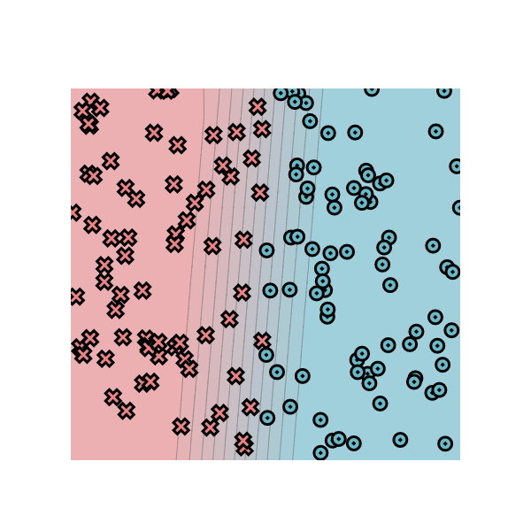

# MiniTorch Module 0

* Docs: https://minitorch.github.io/

* Overview: https://minitorch.github.io/module0.html

Added by Isaac for task 0_5:  
Parameters:  
* Size of hidden layer: 2  
* learning rate: .05  
* number of epochs: 500  
